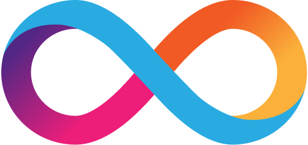

<p align="left" >
  
</p>

# Motoko bootcamp 2023 for dapp-contest

This repository is meant to give [Svelte](https://svelte.dev/) developers an easy on-ramp to get started with developing decentralized applications (Dapps in short) for the Internet Computer blockchain. Dapps, also known as smart contracts are specialized software that run on a blockchain.

This template contains

- a Svelte frontend app under `src/frontend` to be hosted on-chain, with support for authentication using Internet Identity
- a Motoko dapp under `src/backend` to serve as a backend to the Svelte frontend

You can see a deployed version of this template here: <a href="https://z6aq5-yaaaa-aaaal-ackhq-cai.icp0.io" target="_blank">https://z6aq5-yaaaa-aaaal-ackhq-cai.icp0.io</a>

## Install dependencies

Make sure you have [node.js](https://nodejs.org/) installed.

### How to get this template

To clone this template, run the following command:

```
git clone https://github.com/higayasuo/mbc2023-day6
```

### DFX

Install `dfx` by running

```
DFX_VERSION=0.12.0 sh -ci "$(curl -fsSL https://smartcontracts.org/install.sh)"
```

### Rust

To compile a local version of Internet Identity, you need to have [Rust](https://www.rust-lang.org/learn/get-started) installed.

Also install that target `wasm32-unknown-unknown` by running the command:

```
rustup target add wasm32-unknown-unknown
```

## Start the local replica

Open a new terminal window _in the project directory_, and run the following command to start the local replica. The replica will not start unless `dfx.json` exists in the current directory.

```
dfx start --background
```

When you're done with development, or you're switching to a different dfx project, running

```
dfx stop
```

from the project directory will stop the local replica.

## Build & run the dapp

Make sure you switch back to the project root directory.

First, install the frontend dependencies by running

```
cd src/frontend
npm install
cd ../..
```

To build and deploy the project run

```
dfx deploy
```

### Svelte frontend

You can serve the frontend in development mode like you normally develop a svelte app using the command

```
npm run dev
```

from the project root directory, it is not necessary to deploy it to the frontend canister during development.

## Deploying to the IC

To host the frontend and backend on the IC, you'll need to have some cycles available. Cycles pay for the execution of your app, and they are also needed to create canisters.

You can get $20 worth of cycles for free from the Cycles Faucet, if you have a GitHub account. To claim them, follow [this guide](https://smartcontracts.org/docs/quickstart/cycles-faucet.html).

You should have a canister running the cycles wallet on the IC at this point. The cycles wallet makes it easy to pay for canister creation.

You can check the balance by running

```
dfx wallet --network ic balance
```

After making sure you have cycles available you can run

```
dfx deploy --network ic
```

